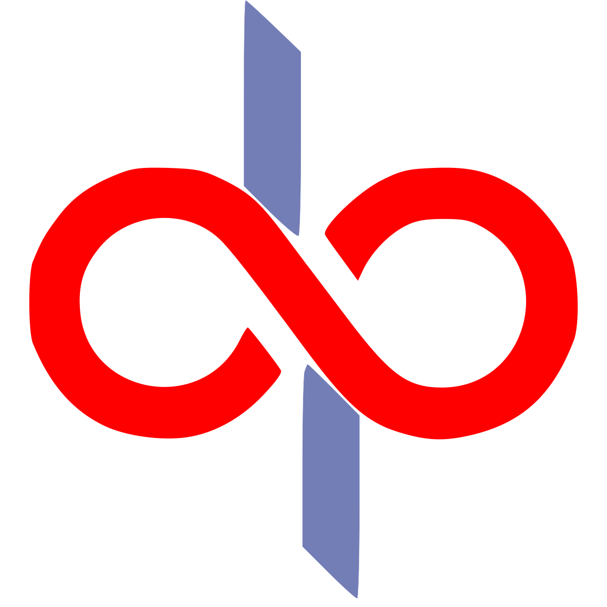

<!-- PROJECT SHIELDS -->

<p align="center">


<a href="https://linkedin.com/in/cm-ch">

</a>
<a href="https://despesa-frontend.netlify.app">

</a>

</p>

<!-- PROJECT LOGO -->
<br />
<div align="center">
  <a href="https://github.com/MrRo-bot/Despesa">
    
  </a>

  <h1 align="center">DESPESA</h3>

  <p align="center">
    <a href="https://despesa-frontend.netlify.app/">View Demo</a>
    &middot;
    <a href="https://github.com/MrRo-bot/Despesa/issues/new?labels=bug&template=bug-report---.md">Report Bug</a>
    &middot;
    <a href="https://github.com/MrRo-bot/Despesa/issues/new?labels=enhancement&template=feature-request---.md">Request Feature</a>
  </p>
</div>

<!-- ABOUT THE PROJECT -->

# About The Project ℹ️💁‍♂️

A Simple `MERN Expense Tracker` WebApp 📱 built with Apollo GraphQL to demonstrate the use of Modern JS libraries and Frameworks 🏗.
I am a software developer with a keen interest in both creating projects and managing personal finances (I'm using expense manager android app since 2018), I recently embarked on a project that combined these passions. The result is `Despesa`, a personal finance tracker built with `Apollo GraphQL and the MERN stack`.

### Features

- CRUD based transaction management,
- Overview of recent transactions, investments and expenses,
- `Sort, Order and Search` in long list of transactions efficiently rendered by `react-virtuoso`,
- `motion.dev` animations,
- Reports based on transaction history,

_Made with love ❤️ by [MrRo-bot](https://github.com/MrRo-bot)_

<!-- SCREENSHOTS -->

# Screenshots 📺

| Login                                                                    |
| ------------------------------------------------------------------------ |
|  |

| Signin                                                                    |
| ------------------------------------------------------------------------- |
|  |

| Overview                                                                    |
| --------------------------------------------------------------------------- |
|  |

| Transactions                                                                    |
| ------------------------------------------------------------------------------- |
|  |

| Form                                                                    |
| ----------------------------------------------------------------------- |
|  |

| Reports                                                                    |
| -------------------------------------------------------------------------- |
|  |

| Collapsible Sidenav                                                                   |
| ------------------------------------------------------------------------------------- |
|  |

| Mobile overview                                                                |
| ------------------------------------------------------------------------------ |
|  |

<!-- BUILT WITH -->

# Built With 🛠️🤖

- [![MongoDB]][MongoDB-url]
- [![Express]][Express-url]
- [![React.js]][React-url]
- [![Node.js]][Node.js-url]
- [![TailwindCSS]][TailwindCSS-url]
- [![Apollo]][Apollo-url]
- [![Chart.js]][Chart.js-url]
- [![DaisyUI]][DaisyUI-url]
- [![Motion]][Motion-url]
- [![ReactRouter]][ReactRouter-url]
- [![Vite]][Vite-url]
- [![NPM]][NPM-url]
- ![Firefox]
- [Passport.js Auth Library](https://choosealicense.com)
- [React Virtuoso](https://choosealicense.com)
- [React Toastify](https://choosealicense.com)
- [React Loading Skeleton](https://choosealicense.com)
- [React Number Format](https://choosealicense.com)
- [Nanoid](https://choosealicense.com)
- [Bcrypt](https://choosealicense.com)
- [React Icons](https://react-icons.github.io/react-icons/search)

<!-- BASIC SETUP -->

# Basic Setup 🗼

_`Node` must be installed on system first, and `MONGO_URI` is required for creation of database, user management and session management._

1. Get database credentials by logging in and creating an account in [MongoDB Atlas](https://account.mongodb.com/account/login).
2. Create database and get MONGO_URI and SESSION_SECRET key. [See Docs](https://www.mongodb.com/docs/atlas/getting-started/)
3. Clone the repo
   ```sh
   git clone https://github.com/MrRo-bot/Despesa.git
   ```
4. Install NPM packages on both backend and frontend folder.
   ```sh
   npm install
   ```
5. Create and enter MongoDB URI and secret in `/backend/.env`
   ```js
   MONGO_URI = MY_URI;
   SESSION_SECRET = MY_SESSION_SECRET;
   ```
6. Follow docs instructions on creation of `Cluster and Collection`.
7. Change git remote url to avoid accidental pushes to base project
   ```sh
   git remote set-url origin MrRo-bot/Despesa
   git remote -v # confirm the changes
   ```
8. Run this command on both backend and frontend folder to initiate the whole project.
   ```sh
   npm run dev
   ```

<!-- ROADMAP -->

# Roadmap 🛣️

- [x] Chart.js chart implementation
- [x] React Virtuoso for performant component rendering
- [x] Ctrl+K for putting focus on search bar in transactions page
- [ ] Deleting and modifying user profile details
- [ ] Time period for graphs
- [ ] Currency change option
- [ ] Multi-language Support
  - [ ] Hindi
  - [ ] Chinese
  - [ ] Russian
  - [ ] Spanish
  - [ ] German
  - [ ] French
  - [ ] Arabic

See the [open issues](https://github.com/MrRo-bot/Despesa/issues) for a full list of proposed features (and known issues).

<!-- LICENSE -->

# License 🪪

Distributed under the Unlicense License. See `LICENSE.txt` for more information.

<!-- CONTACT -->

# Contact 📲

Outlook Mail - [chhavimanichoubey.outlook.in](mailto://chhavimanichoubey.outlook.in)

Discord: [Mr.RO130T](https://discordapp.com/users/434001308484239381)

Project Link: [https://github.com/MrRo-bot/Despesa](https://github.com/MrRo-bot/Despesa)

<!-- ACKNOWLEDGMENT -->

# Acknowledgment 📝

- [![daily.dev]][daily.dev-url]
- [![Dev.to]][Dev.to-url]
- [![Medium]][Medium-url]
- [![Dribbble]][Dribble-url]
- [![Kaggle]][Kaggle-url]
- [![GeeksForGeeks]][GeeksForGeeks-url]
- [![Scrimba]][Scrimba-url]

<!-- MARKDOWN LINKS & IMAGES -->

[stars]: https://img.shields.io/github/stars/MrRo-bot/Despesa?style=for-the-badge
[stars-url]: https://github.com/MrRo-bot/Despesa
[license-shield]: https://img.shields.io/github/license/MrRo-bot/Despesa.svg?style=for-the-badge
[license-url]: https://github.com/MrRo-bot/Despesa/blob/main/LICENSE.txt
[linkedin-shield]: https://img.shields.io/badge/-LinkedIn-black.svg?style=for-the-badge&logo=linkedin&colorB=555
[linkedin-url]: https://linkedin.com/in/cm-ch
[product-screenshot]: images/screenshot.png
[MongoDB]: https://img.shields.io/badge/MongoDB-%234ea94b.svg?style=for-the-badge&logo=mongodb&logoColor=white
[MongoDB-url]: https://mongodb.com/
[Express]: https://img.shields.io/badge/express.js-%23404d59.svg?style=for-the-badge&logo=express&logoColor=%2361DAFB
[Express-url]: https://expressjs.com/
[React.js]: https://img.shields.io/badge/React-20232A?style=for-the-badge&logo=react&logoColor=61DAFB
[React-url]: https://reactjs.org/
[Node.js]: https://img.shields.io/badge/node.js-6DA55F?style=for-the-badge&logo=node.js&logoColor=white
[Node.js-url]: https://nodejs.org/
[TailwindCSS]: https://img.shields.io/badge/tailwindcss-%2338B2AC.svg?style=for-the-badge&logo=tailwind-css&logoColor=white
[TailwindCSS-url]: https://tailwindcss.com/
[Apollo]: https://img.shields.io/badge/-ApolloGraphQL-311C87?style=for-the-badge&logo=apollo-graphql
[Apollo-url]: https://apollographql.com/
[Chart.js]: https://img.shields.io/badge/chart.js-F5788D.svg?style=for-the-badge&logo=chart.js&logoColor=white
[Chart.js-url]: https://chartjs.org/
[DaisyUI]: https://img.shields.io/badge/daisyui-5A0EF8?style=for-the-badge&logo=daisyui&logoColor=white
[DaisyUI-url]: https://daisyui.com/
[Motion]: https://img.shields.io/badge/Framer-black?style=for-the-badge&logo=framer&logoColor=blue
[Motion-url]: https://motion.dev/
[ReactRouter]: https://img.shields.io/badge/React_Router-CA4245?style=for-the-badge&logo=react-router&logoColor=white
[ReactRouter-url]: https://reactrouter.com/
[Firefox]: https://img.shields.io/badge/Firefox-FF7139?style=for-the-badge&logo=Firefox-Browser&logoColor=white
[daily.dev]: https://img.shields.io/badge/daily.dev-CE3DF3?style=for-the-badge&logo=daily.dev&logoColor=white
[daily.dev-url]: https://daily.dev/
[Dev.to]: https://img.shields.io/badge/dev.to-0A0A0A?style=for-the-badge&logo=dev.to&logoColor=white
[Dev.to-url]: https://dev.to/
[Dribbble]: https://img.shields.io/badge/Dribbble-EA4C89?style=for-the-badge&logo=dribbble&logoColor=white
[Dribble-url]: https://dribbble.com/
[Kaggle]: https://img.shields.io/badge/Kaggle-035a7d?style=for-the-badge&logo=kaggle&logoColor=white
[Kaggle-url]: https://kaggle.com/
[GeeksForGeeks]: https://img.shields.io/badge/GeeksforGeeks-gray?style=for-the-badge&logo=geeksforgeeks&logoColor=35914c
[GeeksForGeeks-url]: https://geeksforgeeks.org/
[Scrimba]: https://img.shields.io/badge/scrimba-2B283A?style=for-the-badge&logo=scrimba&logoColor=white
[Scrimba-url]: https://scrimba.com/
[Vite]: https://img.shields.io/badge/vite-%23646CFF.svg?style=for-the-badge&logo=vite&logoColor=white
[Vite-url]: https://vite.dev
[NPM]: https://img.shields.io/badge/NPM-%23CB3837.svg?style=for-the-badge&logo=npm&logoColor=white
[NPM-url]: https://npmjs.com/
[Medium]: https://img.shields.io/badge/Medium-12100E?style=for-the-badge&logo=medium&logoColor=white
[Medium-url]: https://medium.com/
